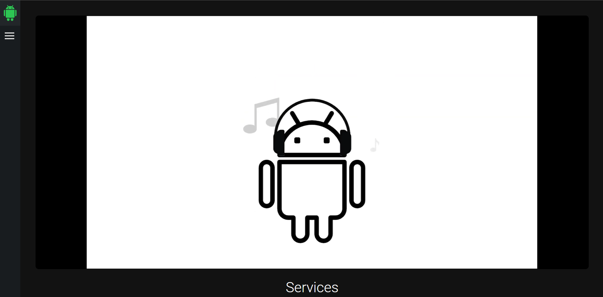
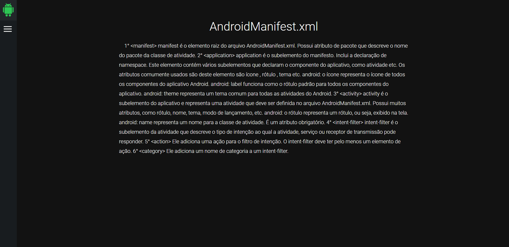
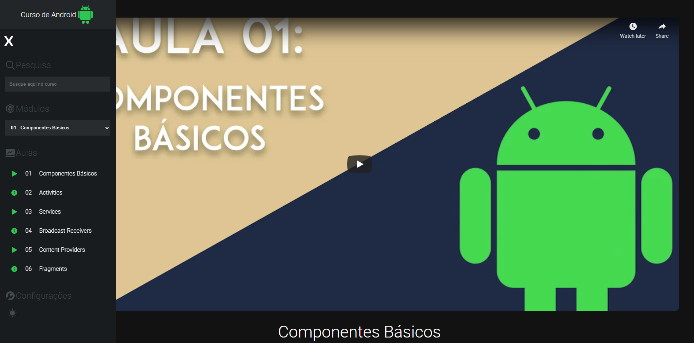

## Objetos Aprendizagem

## Aqui está o link do nosso site -> https://main.d3s40k6kxt6t7a.amplifyapp.com/

O Objetivo do site era ensinar os conceitos e fundamentos dos componentes básicos de um aplicativo Android, nós fizemos videos e materiais de leitura para ajudar o percurso do usuário no nosso site.

O Site utiliza:
+ React  
+ Node  
+ Mysql  

